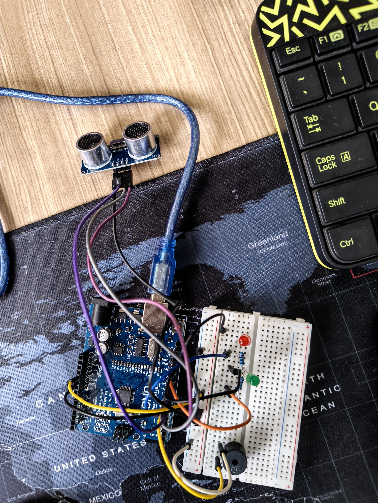

# Ultrasonic Distance Alert System

## 📌 Description

This project measures distance using an ultrasonic sensor and provides alerts using a buzzer and LEDs.
It indicates different distance ranges using sound patterns and visual signals.

---

## 🧰 Components Used

* Arduino Uno
* HC-SR04 Ultrasonic Sensor
* Buzzer
* 2 LEDs (Red + Green)
* Resistors
* Jumper wires

---

## ⚙️ Working Logic

The system behaves based on object distance:

* **Distance < 10 cm**

  * 🔴 Red LED ON
  * 🔊 Continuous buzzer
  * 🚨 Indicates very close object (danger)

* **Distance between 10–30 cm**

  * 🔴 Red LED blinks
  * 🔊 Buzzer beeps intermittently
  * ⚠️ Indicates moderate distance

* **Distance > 30 cm**

  * 🟢 Green LED ON
  * 🔇 No buzzer
  * ✅ Safe condition

---

## 🔌 Pin Configuration

| Component | Arduino Pin |
| --------- | ----------- |
| TRIG      | 9           |
| ECHO      | 10          |
| Buzzer    | 8           |
| Red LED   | 7           |
| Green LED | 13          |

---

## 📷 Project Setup

---

## 🎥 Demo Video

[Watch Video]- https://youtube.com/shorts/Zpm1GEmlM7s?feature=share

---

## 💻 Code

The complete Arduino code is available in the file:
`ultrasonic_alert.ino`

---

## 🚀 Features

* Real-time distance measurement
* Multi-level alert system
* Visual + audio feedback
* Simple and scalable design

---

## 🔧 Future Improvements

* Add LCD display for distance
* Add adjustable threshold using potentiometer
* Integrate with IoT for remote monitoring

---
